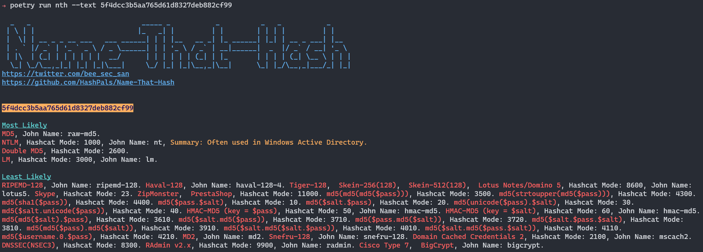
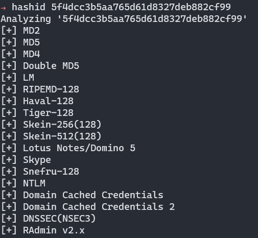
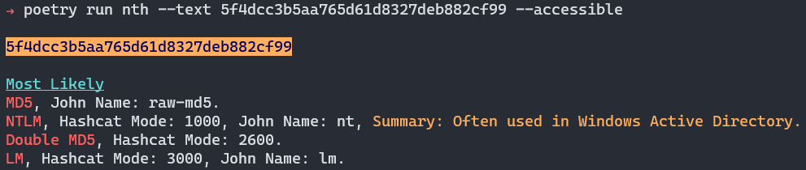
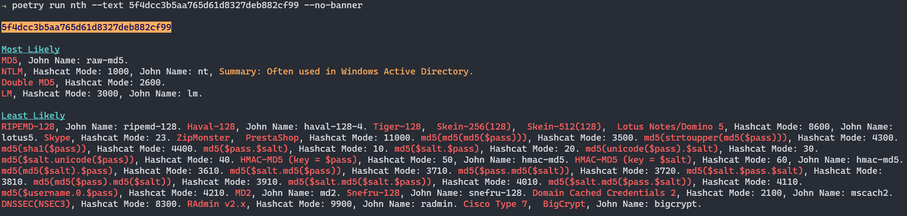
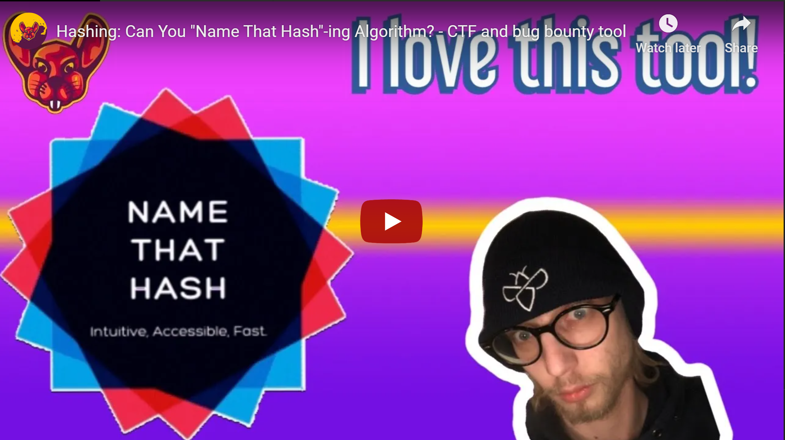
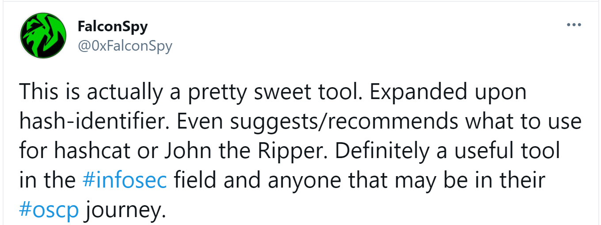

<p align="center">


<p align="center">➡️ <a href="http://discord.skerritt.blog">Discord</a> | <a href="https://nth.skerritt.blog">Website</a> ⬅️</p>
<p align="center">The Modern Hash Identification System<br>
<code>pip3 install name-that-hash && nth</code>
  <br>
  <a href="https://nth.skerritt.blog">Web App with no install needed</a>
</p>

<p align="center">
       
</p>
<hr>

# 🤔 What is this?


Have you ever come across a hash such as `5f4dcc3b5aa765d61d8327deb882cf99` and wondered what type of hash that is? 🤔

Name-that-hash will name that hash type! 

# 🔥 Features
* 📺 **Popularity Ratings** - Name that hash will show you the most popular hashes first. In older systems it would prioritise [Skype Hash](https://en.wikipedia.org/wiki/Skype_security) the same as [Active Directory's NTLM!](https://docs.microsoft.com/en-us/windows-server/security/kerberos/ntlm-overview) Which makes as much sense as saying that my GitHub is as popular as VSCode 📈
* ✍ **Hash Summaries** - no more wondering whether it's MD5 or NTLM. Name-that-hash will summarise the main usage of each hash, allowing you to make an informed & decisive choice ⚡
* 🌈 **Colour Output** - Don't worry, the colours were hand-selected with a designer to be 100% accessible and gnarly 😎
* 🤖 **JSON output && API** - Want to use Name-That-Hash in your project? We are API first, CLI second. Use JSON output or import us as a Python module! 💾
* 👵 **Updated!** - HashID was last updated in 2015. Hash-Identifier in 2011! Name-That-Hash is a 2021 project 🦧
* ♿ **Accessible** - We are 100% committed to making this an [accessible hacking tool](https://skerritt.blog/a11y/) 🙏
* 🎫 **Extensible** - Add new hashes as quickly as you can edit this README. No, seriously -- it's that easy! 🎱

# 🥊 Name-That-Hash vs HashID vs Hash-Identifier

| **Features** | Name-That-Hash | HashID | Hash-Identifier |
| ---- | ---- | ---- | ---- |
| **Last updated** | 2021, check commits. | 17/03/2015 | 30/09/2011 |

Honestly, do you need any more convincing? 😂

Let's compare us to clones. To try to be unbiased, here's the only things you should care about:
* Does it correctly identify hashes? How does it ensure it's accurcate?
* Does it help me, a pentester, identify ambigious hashes like MD4 vs NTLM?
* Is the database of hashes large? No point in using a hash-identifier which only identifies MD4!
* How can I use it? If it's a Nokia only app it'd be hard to use.
* Is it maintained? I don't want to implement unmaintained software.

| **Features** | Name-That-Hash | Hati | 
| --- | --- | ---|
| Is it correct? | Yes, Name-That-Hash has 3197 tests to ensure all of our checks are correct. We even have an automated-test-matrix which checks all of our hashes against HashCat and John the Ripper. The _second_ they update the MD4 mode, add a new hash, or more examples we update our program. We're also used in programs with millions of downloads, and in chat servers with 70k+ people. If we incorrectly identify something, we'll know. | Kind of. There is no testing for Hati but everytime Name-That-Hash updates itself, Hati usually takes our updates within a week or two. Why wait when you can get it from the source? |
| Does it help you? | Yes, Name-That-Hash has descriptions, links, and sorts hashes by rarity. If you're lost between MD4 and NTLM, the descriptions will tell you that NTLM is Windows and that might help you. We also sort hashes, so you'll never see Skype hash before SHA256. | Hati does not have any of these features. |
| Is the database large? | Yes, we have the largest database of hashes. Because of our automated test matrix, we will always be the most up-to-date with correct information. **In fact, we're so good at keeping our database up to date other programs steal it from us!** | Technically, Hati has a larger database. This is because they support things that aren't hashes. I'd suggest being careful if you expected it to only return hashes. |
| How can you use it? | Web app, Discord bot, CLI, CLI that returns JSON, Accessible CLI, Python Library, Web API | Ruby CLI and Ruby Library |
| Is it maintained? | Yes, Name-That-Hash is maintained by a collective of open source creators. Around 5 people actively work on it. | 1 person works on Haiti |


But, let's look at the features more in-depth.

## 📈 Feature Comparison



Here HashID displays Skype before NTLM, whereas Name-That-Hash understands popularity of hashes so places NTLM before Skype.



📕 You can also see Name-That-Hash displaying a summary, whereas HashID doesn't. In the default view it also displays John + HashCat information. Because let's face it, the only reason you're using this tool is to figure out what to put into HashCat! 🐱‍🚀

Name-That-Hash is radically different from HashID, I'm not going to list all the differences -- you can physically see them yourselves 😎

## 💌 Accessibility

Name-That-Hash is an [accessible hacking tool](https://skerritt.blog/a11y/). That means we spent time designing things, such as....



Removing the ASCII Art of very long "least likely" text blocks using `--accessible`.

Doing this means you don't get access to least likely, and if the hash is in that pile it'd suck. So we also have `--no-banner`.



Which removes the ASCII art banner.

# 🔨 Installation

**Easy Mode** Use our web app at [https://nth.skerritt.blog](https://nth.skerritt.blog).

You can install using Python's Pip.

```
pip3 install name-that-hash
```

or:

```
pip install name-that-hash
```

And then run:

```
nth
```

To use.

[](https://repology.org/project/name-that-hash/versions)

We're also in:
* [REMnux](https://remnux.org/).
* [The Arch User Repository (AUR)](https://aur.archlinux.org/packages/python-name-that-hash).
* [MacPorts](https://ports.macports.org/port/name-that-hash/summary).
* [Homebrew](https://formulae.brew.sh/formula/name-that-hash).

# ⚱ Fun Facts

* We have a test-matrix which makes sure all of our hashes are up-to-date, including the HashCat mode and John the Ripper modes!
* Unlike other hash identifiers which identify non-hashes, we have removed these so you'll only get real hashes (base64 who?)
* Each and every hash is tested multiple times, for both false positives and true positives. No mistakes here!
* There is a magical lamp that summons a genie somewhere in the source code.

# 💡 Documentation
Want to learn how popularity works?

What about using this in your own programs?

Or maybe even our commitment to accessibility?

Our documentation is for you!

| 📚 **Documentation** | 🐦 **My Twitter (@ me for questions)** | 🎳 **Discord** | 🧩 **Web App**
| --------------- | ----------------------------------- | ---------------- | ---------------- | 
| [Wiki](https://github.com/HashPals/Name-That-Hash/wiki) | [https://twitter.com/bee_sec_san](https://twitter.com/bee_sec_san) | [Discord](https://discord.gg/zYTM3rZM4T) | [Web App](https://nth.skerritt.blog) |

# 🙏 Contributing

The easiest way to contribute is by adding more hashes, writing descriptions, or changing their REGEX> All you have to do is go to [this file](https://github.com/HashPals/Name-That-Hash/blob/main/name_that_hash/hashes.py) and edit it.

You can read more about [contributing here](https://github.com/HashPals/Name-That-Hash/wiki/Contributing).

# 💌 Thanks

Many thanks to [Jabba](https://github.com/JabbaTheBunny) & Jayyy for their help :)

Thanks to [HashID](https://github.com/psypanda/hashID) and [Hash-Identifier](https://code.google.com/archive/p/hash-identifier/) for their work in this field, which heavily inspired this. 💝 The database of hashes was originally taken from them, but we've significantly modified it. Thank you so much for creating that database of 3000+ hashes 😻

Thanks to the TryHackMe Community too, and especially [Oriel](https://twitter.com/OrielOrielOriel) for her feedback on early versions.

And special thanks to Varg on his masterful understanding of colour theory 🌈

Finally, thanks too Blackout for helping write descriptions of hashes 🐱‍👤

# 📺 What people are saying
<a href="https://www.youtube.com/watch?v=pems0PD7L2g"></img></a>



[We're in REMnux!](https://twitter.com/REMnux/status/1355874578405466114)

## Contributors ✨

<!-- ALL-CONTRIBUTORS-BADGE:START - Do not remove or modify this section -->
[](#contributors-)
<!-- ALL-CONTRIBUTORS-BADGE:END -->

Thanks goes to these wonderful people ([emoji key](https://allcontributors.org/docs/en/emoji-key)):

<!-- ALL-CONTRIBUTORS-LIST:START - Do not remove or modify this section -->
<!-- prettier-ignore-start -->
<!-- markdownlint-disable -->
<table>
  <tr>
    <td align="center"><a href="https://github.com/digitalsleuth"><br /><sub><b>Digital Sleuth</b></sub></a><br /><a href="https://github.com/HashPals/Name-That-Hash/commits?author=digitalsleuth" title="Code">💻</a></td>
    <td align="center"><a href="https://github.com/amadejpapez"><br /><sub><b>amadejpapez</b></sub></a><br /><a href="https://github.com/HashPals/Name-That-Hash/issues?q=author%3Aamadejpapez" title="Bug reports">🐛</a> <a href="https://github.com/HashPals/Name-That-Hash/commits?author=amadejpapez" title="Code">💻</a></td>
    <td align="center"><a href="https://github.com/SkeletalDemise"><br /><sub><b>SkeletalDemise</b></sub></a><br /><a href="https://github.com/HashPals/Name-That-Hash/commits?author=SkeletalDemise" title="Code">💻</a> <a href="#maintenance-SkeletalDemise" title="Maintenance">🚧</a> <a href="#ideas-SkeletalDemise" title="Ideas, Planning, & Feedback">🤔</a></td>
    <td align="center"><a href="https://skerritt.blog"><br /><sub><b>Brandon</b></sub></a><br /><a href="https://github.com/HashPals/Name-That-Hash/commits?author=bee-san" title="Code">💻</a> <a href="#maintenance-bee-san" title="Maintenance">🚧</a> <a href="#ideas-bee-san" title="Ideas, Planning, & Feedback">🤔</a></td>
    <td align="center"><a href="http://swanandx.github.io"><br /><sub><b>Swanand Mulay</b></sub></a><br /><a href="https://github.com/HashPals/Name-That-Hash/commits?author=swanandx" title="Code">💻</a></td>
  </tr>
</table>

<!-- markdownlint-restore -->
<!-- prettier-ignore-end -->

<!-- ALL-CONTRIBUTORS-LIST:END -->

This project follows the [all-contributors](https://github.com/all-contributors/all-contributors) specification. Contributions of any kind welcome!
